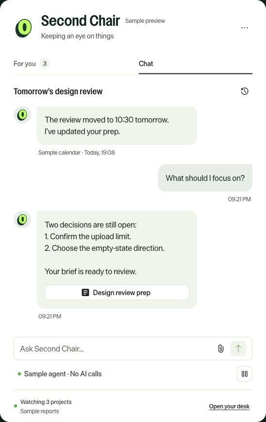
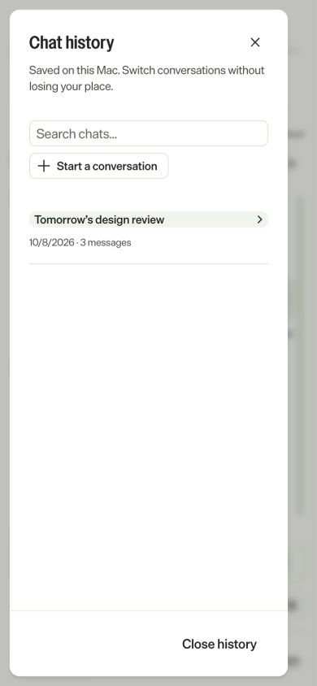

# Second Chair

A local chief-of-staff companion for individual contributors: a Mac menu-bar app for findings,
private chat with Claude, and a browser desk. A separate Claude plugin supplies the deeper
briefing, memory, and sweep workflows.

*A second chair knows the case as well as first chair, prepares every argument, and never stands up
to deliver one.*

**[Download the Mac app — 0.3.1, Apple silicon](https://github.com/davidoliversteinberg/second-chair/releases/tag/v0.3.1)** ·
**[App guide](docs/companion.md)** · **[Claude plugin guide](docs/plugin.md)**

The app is a developer preview, ad hoc signed and not notarized. The current download is for
Apple silicon; the older 0.3.0 release has an Intel build. This is a community project, not an
official Optimizely product or evidence of company approval.

## The app and the plugin are different parts

| Part | Where you use it | What it provides |
|---|---|---|
| **Second Chair app** | The green O in the Mac menu bar, or its local browser desk | For you, Claude chat, chat history, local notifications, source health, usage |
| **chief-of-staff plugin** | A Claude host where you separately install and enable the plugin | Briefs, sweeps, task capture, memory, reviews, and host-supported scheduling |

**The `/chief-of-staff:…` commands belong to the Claude plugin host. They do not currently run
inside the app's Chat tab.** Downloading the app does not install the plugin, and installing the
plugin does not install or update the app. You can use either independently, or connect plugin
reports to the app.

## Start with the Mac app

1. Download and extract the matching ZIP, place **Second Chair.app** in Applications, and open it.
   The packaged app includes its runtime; Node.js and npm are not needed.
2. Click the green **O**. Open **More options → Source health** to check which account and connectors
   the bundled Claude runtime can reach. Chat uses an existing Claude login recognized by that
   runtime; reports work without a login. Being signed into a website alone does not prove it is ready.
3. Use **Chat** for questions, **History** to switch saved chats, and **Open your desk** for the
   browser view. In **For you**, review findings written by a connected report producer.

The packaged app registers Start at login on its first normal run unless policy disables it.
You can turn that off from the O menu. Closing the window leaves it running; quitting or sleeping
the Mac stops checks. Saved chats and findings persist. A browser bookmark needs the app/server to
be running. See [installation and recovery](docs/companion.md) for device-policy and port details.

## What works in app version 0.3.1

| In the app | What it actually does |
|---|---|
| **For you** | Imports local producer reports and surfaces cited findings. It does not start a company-content sweep. |
| **Chat** | Answers and drafts using a bounded report snapshot, an optional text attachment, and available read-only Claude connector tools. |
| **History** | Searches and resumes chats created in this app. It does not import existing Claude/Cowork conversations. |
| **Action steps and links** | Displays steps and a direct destination when the report supplies them. Opening a link does not complete the external task. |
| **Got it / Mark done / snooze** | Changes local finding state. It does not edit a ticket, grant access, or notify a teammate. |
| **Notifications and quiet hours** | Native Mac alerts while running, subject to OS settings. Browser-only mode has no native notifications. |
| **Source health** | Separates report freshness from connector availability and local folder checks. |
| **Usage and cadence** | Shows measured SDK session totals and estimated cost, excluding other apps and report producers. |

Company-login chat only enables tools that connected services identify as read-only. Availability
varies by account and policy; this repo grants no Microsoft 365 or other company access. The app
has no plugin command dispatcher, autonomous job queue, teammate messaging, or file-editing agent.
Those agent-work capabilities are described in a [proposal](docs/agent-workflow.md), not shipped.

The current design follows Optimizely branding and the
[frontend-designer skill](https://github.com/davidoliversteinberg/frontend-designer).

<table><tr><td></td><td></td></tr></table>

*Sample data only. The chat image shows the original 0.3 layout; the history image shows the 0.3.1
addition. Sample conversations make no AI calls. [More screenshots](docs/companion.md#screenshots-and-validation).*

## Connect the plugin's reports

Install the plugin in its Claude host using the [plugin guide](docs/plugin.md#install-in-claude-code).
Then use this one-time connection:

1. Copy **Report folder** from the app's **Source health** view.
2. In the **Claude plugin host**, run `/chief-of-staff:companion` in your private workspace and
   supply that path. The host must be able to write to it.
3. Run `/chief-of-staff:sweep` there and verify that a dated report arrives in the app.

The connection exchanges JSON reports, not whole chat histories or workspace memory. Reports carry
findings, citations, coverage, and optional action steps. A producer is the Claude session or other
process that reads sources and writes those reports. You can also supply them from another permitted
local producer using the [report contract](chief-of-staff/skills/companion-notify/references/report.md).

**[Full Claude command reference](docs/plugin.md#commands--only-in-the-claude-plugin-host)** —
including setup, brief, digest, capture, sweep, reviews, and automate. None is an app slash command.

## What happens automatically, and what costs tokens

| Activity | Default cadence while available | Model usage |
|---|---|---|
| Local report import | Every 30 seconds; also startup and native wake | No model prompt |
| Browser connection check | Every 30 seconds and on reconnect/return | No model prompt |
| Claude connector availability | Every 15 minutes; also startup, native wake, and manual checks | No model prompt |
| Chat analysis | When you send a message | Uses model tokens; depends on context, tools, reply, and cache |
| Plugin source sweeps | Only when invoked or separately scheduled in its host | Uses that host's model; outside app usage totals |

There is **no automatic company-content scanning schedule installed by the app**. The plugin's
`automate` command helps configure a capable host; its proposed times are not proof that a schedule
exists. A cloud routine also needs a supported route to the Mac before it can deliver local reports.

**Usage and cadence** reports SDK estimates for measured sessions, not an account invoice or a
complete record of past activity. See [usage details](docs/companion.md#checking-cadence-and-model-usage).

## Updating GitHub, the app, and the plugin

| What changed | What users need to do |
|---|---|
| README or other documentation on GitHub | Read the updated page. This does not change the installed app. |
| A new packaged app release | Quit the app, replace it with the matching download, and reopen it. Updates are currently manual. |
| Plugin instructions | Update the installed plugin in its Claude host. This does not update the Mac app. |
| A source checkout | Pull the changes, follow the build instructions, and restart the local server or rebuild the app as appropriate. |
| A saved routine prompt | Review/update that routine in its host. A repository update does not rewrite it. |

The plugin manifest is **0.3.0**; the companion package is **0.3.1**. Version numbers describe their
own components. A GitHub push alone does not update an installed binary or cached plugin.

## Data and permissions

Keep private profiles, reports, and workspaces outside this public repository. App data stays in
its local data directory, but live chat sends selected context and connector results to Claude;
local storage does not mean local-only model processing. Use the account, connectors, and data
flows permitted by your organization. Signing into Microsoft apps does not grant this app access.

The companion does not send messages to colleagues or change company permissions. A local
notification reaches you, not your team. Read more in the [app data guide](docs/companion.md#storage-privacy-and-removal)
and [plugin workspace guide](docs/plugin.md#keep-the-workspace-private).

## Documentation

- [Mac app installation, chat, report setup, recovery, and usage](docs/companion.md)
- [Claude plugin installation, commands, memory, and scheduling](docs/plugin.md)
- [Architecture, runtime boundaries, and verification](docs/architecture.md)
- [Plugin connector roles and dated capability notes](chief-of-staff/CONNECTORS.md)
- [Proposed agent jobs and team communication — not shipped](docs/agent-workflow.md)
- [Changelog](CHANGELOG.md)

## License

MIT. See [LICENSE](LICENSE) and [asset provenance](companion/NOTICE.md).
