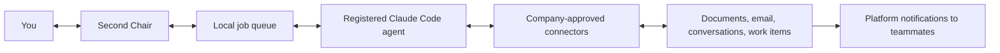

# Agent work and company communication — proposed next increment

Status: design proposal, not shipped in companion 0.3.1. Keep the existing appearance and Chat / For
you layout. The first integration target is the user's local Claude Code agents. Company-approved
Claude and connectors would be the execution environment; the proposed companion would provide
delegation, review, and updates. No new company integration is enabled by this document.

## Product model

A chat belongs to a named agent and workspace. A request becomes a durable job with a session ID,
source scope, permitted actions, and an owner. The agent works; Second Chair displays progress and
outputs. Completion must include the resulting artifact or source link and a clear account of what
changed. The shipped 0.3.1 app has its own chat with read-only connector access when a Claude login
is available, plus an isolated API fallback. It does not load the chief-of-staff plugin, attach to
existing agent conversations, or implement this durable job model. See [current architecture](architecture.md).

Proposed job states: Queued → Working → Needs approval / Needs sign-in → Done / Failed / Cancelled.
After a crash or ambiguous network response, reconcile the source operation before retrying so a
comment or message is not posted twice. Finished turns are not automatically finished jobs.

Claude Code's supported CLI can stream structured events and resume a specified session. Its normal
mode can load configured skills, plugins, and workspace context; bare mode deliberately omits them.
The bridge must register trusted workspaces explicitly, honor organization-managed settings, and
report which capabilities actually loaded. Do not infer compatibility from an app being installed.
Start with bridge-owned sessions; attaching to a running terminal needs a separately validated
supported interface. [Claude Code programmatic interface](https://code.claude.com/docs/en/headless)

Completion and attention hooks can deliver events from opted-in existing sessions. Only allowlisted
event fields should reach Second Chair; do not copy whole transcripts by default. Merge an opted-in
hook into existing settings rather than replacing them. [Hooks](https://code.claude.com/docs/en/hooks)

## Knowledge comes through approved access

The goal is a broad understanding of the user's permitted work, with evidence for every finding.
Each source needs its owner/account, available read/write tools, last successful check, coverage,
and an explicit Connected / Needs sign-in / Not approved / Unavailable state. Never treat missing
access or an old cached summary as evidence that nothing changed.

An approved connector can return selected messages, documents, meetings, and work items. Convert
these into cited decisions, commitments, deadlines, people, and open questions; retrieve the
original when more detail is needed. Keep source URLs, timestamps, observed/inferred labels, and
project scope. Respect source ACL changes, deletion, and retention when retaining derived context.
Source text is evidence, not permission to issue commands or expand access.

The current Microsoft 365 connector documents search across SharePoint, OneDrive, Outlook, and
Teams, with additional write tools when an admin enables them. It requires Microsoft tenant setup
and consent; availability in this organization and in the selected Claude Code runtime still needs
verification. Signing into Word, Outlook, or Teams alone does not authorize Second Chair. Read
access does not imply send/edit access. [Microsoft 365 connector](https://support.claude.com/en/articles/15183774-connect-to-microsoft-365)

Use the company's managed connector catalog where available. Organization-managed MCP policy
continues to apply; an external plugin is not an exception. Do not copy tokens, browser cookies, or
personal credentials into Second Chair. A local worker may still send data to the configured Claude
service; local execution is not local-only inference. [Managed MCP](https://code.claude.com/docs/en/managed-mcp)

## Notify teammates through the work they already share

Private chat with an agent does not notify a colleague. A draft becomes shared only when it is
posted to an authorized shared destination. Prefer a comment, mention, or assignment on the actual
work item. For example, CMP campaign comments can notify mentioned people in CMP, by email, or
both. Available notification settings and destination permissions govern delivery. Do not claim a
notification was read or delivered without evidence. [CMP comments](https://support.optimizely.com/hc/en-us/articles/8185746753037-Manage-campaigns)

If the organization uses Optimizely Opal Team Messaging, its existing in-app notifications are
another possible destination. Do not assume an agent can post there merely because the feature
exists; connector/API support must be verified. [Opal notifications](https://support.optimizely.com/hc/en-us/articles/47381290535693-Team-Messaging-notifications)

Teams messages or activity-feed notifications can be added when the corresponding app and
permissions are approved. A custom Teams activity integration requires installation/consent; a
local-only companion cannot silently notify everyone across the tenant. A shared Second Chair
inbox would likewise need a shared backend, recipient identity/access checks, and approved hosting.
It is a separate team product, not a consequence of installing the Mac app.
[Teams activity notifications](https://learn.microsoft.com/en-us/graph/teams-send-activityfeednotifications)

## Daily sign-in is a recoverable state

Attempt authorized connector access while its session is valid. When Microsoft or Duo requires
interaction, checkpoint the job, preserve its draft, show one useful sign-in request, and let the
user complete the normal authentication flow. Resume and revalidate the destination after that
flow succeeds. Do not retry MFA in a loop, approve challenges automatically, or reuse stolen/copied
session state. Policy is controlled by the identity administrator, not the agent. A notification can
arrive while opening its underlying item still requires sign-in.
[Microsoft session controls](https://learn.microsoft.com/en-us/entra/identity/conditional-access/concept-session-lifetime)
[Microsoft authorization](https://learn.microsoft.com/en-us/graph/auth/auth-concepts)
[Duo policy](https://duo.com/docs/policy)

## First implementation slice

1. Register one trusted local Claude Code workspace and one named chief-of-staff agent.
2. Add a durable job/session bridge, streamed updates, cancellation, and restart recovery.
3. Add a capability/connection check before promising access to any company source.
4. Prove one workflow: retrieve authorized context → prepare an artifact → notify the user locally.
5. Add a reviewed comment to one already-approved shared platform, with a link back and verified
   posting status. Other shared actions remain unavailable until their capabilities are verified.

This increment needs no change to the accepted visual design. It must not silently install plugins,
change managed policy, provision a tenant-wide bot, or treat company approval of Claude as blanket
approval of every custom app and data flow.
