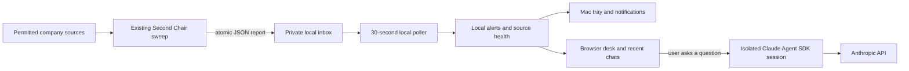

# Companion architecture and limits

The **skill** describes the chief-of-staff work. The **producer host** schedules and executes it with
the connectors that host actually has. The **companion** is a delivery and conversation surface.
It does not inherit Cowork permissions or continuously read Microsoft 365 by itself. Another local
agent can publish the same report contract; this is one-way report interchange, not autonomous
agent-to-agent delegation. OpenClaw, Hermes, and company bots are not dependencies.

## Runtime

- React/Vite frontend, shared between browser and Electron.
- Node HTTP server bound to `127.0.0.1`, no LAN binding, remote hosting, or wildcard CORS.
- Strict Host/Origin checks, random per-launch mutation token, restrictive CSP, plain-text rendering
  of reports/model replies, and no renderer Node integration. Any process in the same user account
  can access loopback; this is not isolation from a compromised local account.
- Atomic JSON state writes and stable `producer:id` + integer revision deduplication. No database
  or cloud service is required for monitoring. App-owned files are private, outside this repository.
- Reports are bounded to 256 KB and 100 findings; each poll reads at most 200 regular JSON files.
  Symlink report files and unknown schema fields are rejected. A producer's failed/partial read
  remains visible. Reports are evidence, not executable instructions.
- Quiet-hour release and wake-up use one batch notification. Delivery state is persistent, but
  OS notification delivery has no acknowledgement guarantee. An OS failure or a process crash at
  the delivery boundary may miss or repeat a notification. The inbox is the persistent record.
- Chat sessions use the official Agent SDK with `tools: []`, empty setting sources, strict empty
  MCP configuration, isolated config directory, `dontAsk`, a deny callback, budget and timeout.
  Only an explicit API key enables a live call. Chat cannot mutate files or accounts.

The frontend template's Sites packaging files are retained for compatibility. **Do not deploy this
private app to Sites as-is**: the localhost backend is required and has no remote-user authentication.
`npm run dev` is a frontend development server only; use `npm run build` then `npm start` for the
working companion. `npm run preview` likewise does not provide the backend.

## Verification

Run `npm test` in `companion/`. Behavior tests cover persisted deduplication, revisions, acknowledgment
versus resolution, snooze expiry, quiet hours, pausing, malformed/partial/symlink reports, missing
folders, unsafe URLs, local request boundaries, absent API credentials, and chat streaming/resumption
using a fake provider. Template packaging tests also run.

The release includes browser interaction and visual QA in [design-qa.md](../companion/design-qa.md).
The live Anthropic service is **not tested without a user-provided API key**. The tests exercise the
integration contract, not provider billing, a live model, or enterprise connectors. Native notification
appearance depends on macOS permissions and Focus mode. Signing, login-item persistence after reboot,
sleep/wake delivery, and other operating systems require further device testing.

## Next useful increments

1. Signed/notarized installers and secure GUI credential setup.
2. Explicit, separately configured read-only source adapters with their own permissions and health.
3. Event-driven collection where a permitted source supports it; measured polling elsewhere.
4. Richer retrieval of a chosen private workspace, with path scoping and clear provenance.
5. Reviewable drafts and explicitly approved actions in external apps.

More agents do not solve missing source access or silent delivery. These steps should preserve the
report contract and attention controls before expanding what the assistant can do.

Implementation references: [Claude Agent SDK](https://platform.claude.com/docs/en/agent-sdk/overview),
[SDK permissions](https://platform.claude.com/docs/en/agent-sdk/permissions),
[Electron security](https://www.electronjs.org/docs/latest/tutorial/security), and
[Axiom components and icons](https://github.com/optimizely-axiom/optiaxiom) and the [Phosphor identity mark](https://github.com/phosphor-icons/react). The SDK's authentication and redistribution
terms apply separately from this repository's MIT license.
