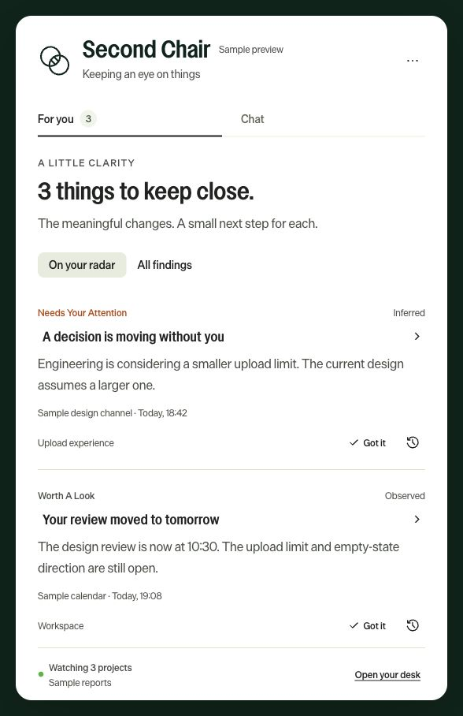
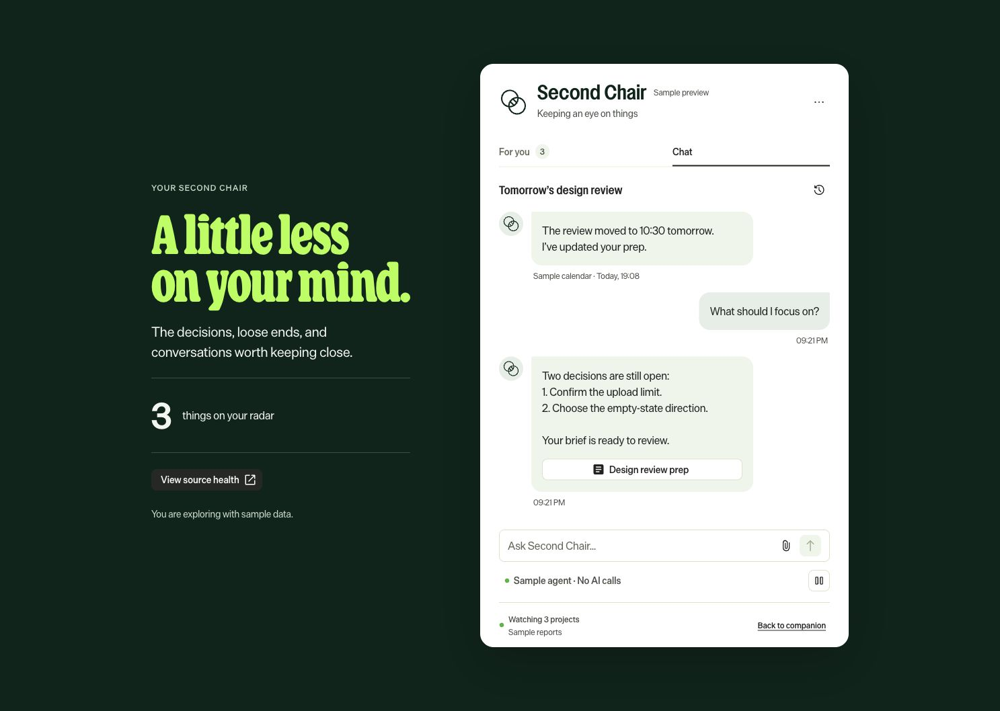
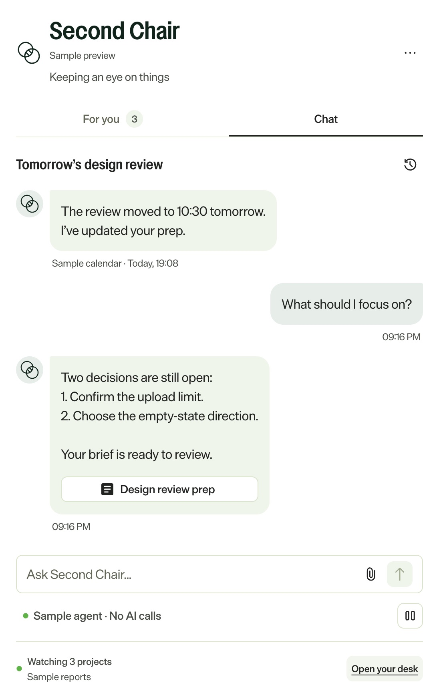
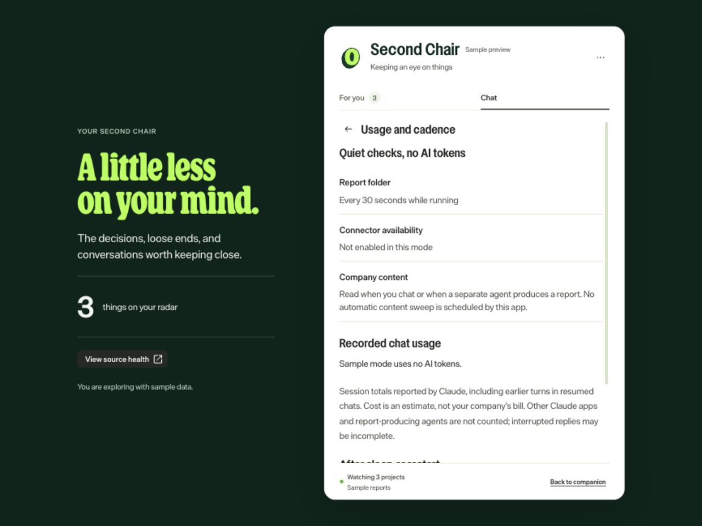

# Second Chair companion 0.3.1 — developer preview

[Back to Second Chair](../README.md) · [Separate Claude plugin guide](plugin.md)

The companion is the **Mac app and local browser desk**. It has its own Claude chat and can display
reports written by the separate plugin or another local producer. You can try sample data before
connecting anything.

**Use ordinary questions in the app's Chat tab.** It does not currently load the chief-of-staff
plugin's slash commands or private workspace files. `/chief-of-staff:setup`, `brief`, `sweep`, and
`automate` run in the Claude host where that plugin is enabled, not here. Installing the plugin is
optional for app chat; a producer is needed for ongoing content findings in For you.

## Packaged Mac app

Builds are architecture-specific: **arm64** for Apple silicon and **x64** for Intel. Each contains
**Second Chair.app** with its runtime and the matching bundled Claude binary. The 0.3.1 preview download is Apple silicon/arm64; the older 0.3.0 download is Intel/x64.
[Download Second Chair 0.3.1](https://github.com/davidoliversteinberg/second-chair/releases/tag/v0.3.1).

- **Menu-bar icon.** Drag the app to Applications and open it once. A packaged build then registers
  itself to open at login, unless policy disables that registration. Turn it off from the icon's right-click
  menu; the app will not turn it back on. If startup fails (for example a damaged data file), the
  icon stays and shows **!** with the reason, instead of disappearing.
- **Busy port.** The browser desk prefers port 4318 (also the OpenTelemetry default). If another
  program has it, the app picks a free port; use **Open your desk in browser** from the icon's menu.
- **Existing Claude login.** Chat uses an account recognized by the bundled Claude runtime. Check
  Source health to confirm it is available. Report display and notifications work without a login.
- **Developer preview.** The download is signed ad hoc, without Developer ID or notarization. macOS
  or managed-device policy may block it. Where your device policy permits, macOS offers **Open Anyway**
  in **System Settings → Privacy & Security**. Company-wide rollout needs
  a Developer ID signed, notarized build; see [Company rollout](#company-rollout).

### Company rollout

Set repository secrets `MAC_CERT_P12`, `MAC_CERT_PASSWORD`, `APPLE_API_KEY_P8_PATH`,
`APPLE_API_KEY_ID`, and `APPLE_API_ISSUER` (a Developer ID Application certificate and an App Store
Connect API key from your organization's Apple Developer account). Running the **Companion checks**
workflow with *Build Mac packages* then produces signed, notarized arm64 and x64 ZIPs, each
smoke-tested (`npm run smoke:mac`). The signed path is untested until those credentials exist.
Distribute through your device-management tool; set `SECOND_CHAIR_NO_LOGIN_ITEM=1` if IT manages login
items itself. Updates are manual until an updater is added.

For source builds or report/chat setup, follow the sections below.

## Try it from source

Requires Node.js 22 or newer and npm. The browser desk works without Electron; native notifications
and the tray require the desktop app. Mac is the packaging target in this preview.

```bash
git clone https://github.com/davidoliversteinberg/second-chair.git
cd second-chair
cd companion
npm ci
npm run build
npm run demo
```

Open **http://127.0.0.1:4318**. Sample mode creates an isolated temporary data folder each launch,
uses fictional reports and scripted chat replies, and makes no AI calls. It is labeled throughout.

To try the tray, stop the browser server with Ctrl+C first (they share port 4318):

```bash
npm run assets
npm run desktop:demo
```

If npm disabled Electron's install script, run `node node_modules/electron/install.js` once.
Click the green **O** in the menu bar to show/hide the window. **Drag the small grip at the very top or the
Second Chair title area to move it.** The app saves the position and size, including across restarts
in normal mode. Sample mode starts with a fresh temporary profile each launch.
Right-click the menu-bar icon for **Move window back to menu bar**, the browser desk, and Quit.
If a monitor is disconnected, the window is fitted inside an available display the next time it
opens. Closing the window leaves the app running.

## Use your own reports

If you installed the packaged app, simply open it. For a source checkout, run these from `companion/`
after building, instead of sample mode:

```bash
npm run desktop
# Or run only the local browser server:
npm start
```

Open **More options → Source health** and copy its **Report folder** path. In the **separate Claude
host with the plugin enabled**, open your private Second Chair workspace and run
`/chief-of-staff:companion`, then provide that path. Do not enter this command in the app chat. The command records
the destination in PROFILE.md. Subsequent ambient sweeps publish their cited findings there when
they have filesystem access. For previously created routines, update the saved prompt to load
`companion-notify` after the sweep, including on quiet or partial runs. Updating the plugin alone
does not rewrite already saved schedules.

**There are two processes:** the producer reads your permitted sources; the companion delivers
its reports. A cloud routine that cannot access your Mac cannot write to this inbox. Installing
the companion does not create a Teams connection, replace the producer's schedule, scrape Teams,
or bypass tenant controls. Start with reports from a source you already use, or the sample below.

To test report delivery without connecting a source, copy the [synthetic example](example-report.json)
into the displayed inbox. It is not live company evidence. The companion imports it on the next
30-second check, or immediately with **Check folder now**. Existing unresolved findings import too;
they may produce one batch notification outside quiet hours.

To publish from a script or another local agent, use the portable bridge:

```bash
python3 chief-of-staff/skills/companion-notify/scripts/publish_report.py \
  /absolute/private/workspace/report.json \
  --inbox /absolute/path/from/source-health
```

Run that command from the repository root, or use the full helper path from an installed plugin.
It writes `<producer>.json` atomically. Full field validation occurs in the app. See the
[report contract](../chief-of-staff/skills/companion-notify/references/report.md).

## Chat with Claude

### Existing-login mode

The packaged app and normal source launcher ask the bundled Claude runtime which account and
connectors it can reach. When it recognizes a signed-in account, chat uses that login. An API key
is not required for this mode. A successful sign-in to the Claude website, Teams, or Outlook alone
is not a guarantee that this runtime can use the same account or sources.

Open **More options → Source health** to inspect the reported account, available connectors, and
errors. Use **Check connections now** after signing in or reconnecting through your approved Claude
setup. Checks also run at startup and every 15 minutes. If a previously connected source needs
sign-in, the app can notify you; required Microsoft/Duo interaction still happens in the normal
sign-in flow.

Chat enables only connector tools reported as read-only and not destructive. A connector may expose
mail, calendar, Teams, documents, or other source tools, but the app does not guarantee every listed
service or capability. Tools without the required read-only declaration remain unavailable; there
is no app control to override that restriction. The connector's declarations and actual permissions
both matter.

### What a chat can do

Ask a normal question, such as “What needs my attention?” or “Help me prepare for tomorrow.” Chat
can use unresolved reports, the current conversation, a selected attachment, and permitted connector
reads to answer or draft text. Attach one `.md` or `.txt` file under 30 KB; only that selected file
is read. **History** resumes conversations created in this app.

The app does not load the chief-of-staff plugin, run its slash commands, read `PROFILE.md` or
`TASKS.md` automatically, or attach to an existing Claude Code/Cowork conversation. It has no shell
or general local file-editing tools. It cannot send, post, grant access, update tasks in another app,
or dispatch an autonomous job. Asking for a plan is not executing that plan.

| Runtime mode | Available context/tools | Limits per request |
|---|---|---|
| Existing Claude login | Report snapshot, attachment, resumed conversation, allowed read-only connector tools | 12 SDK turns, $1.50 estimated budget, three-minute timeout |
| Developer API-key fallback | Report snapshot, attachment, resumed conversation; no connector or action tools | One SDK turn, $0.50 estimated budget, two-minute timeout |
| Sample | Synthetic reports and scripted replies | No model calls |

These are SDK limits, not expected message prices or independent billing guarantees. A tool-assisted
reply can take multiple SDK turns. Account eligibility and provider terms still apply. Only one
reply runs at a time; **Stop** cancels it. The app keeps an error and any partial response when a
turn fails. If it exits mid-turn, the next launch reports the interruption. Resuming includes the
session's earlier context, even if a finding has since been marked done.

### Developer API-key fallback

If no logged-in account is available and `ANTHROPIC_API_KEY` is present at startup, the server can
use the isolated API mode. A recognized login takes precedence over the key. Supply credentials
through your usual secure environment setup, then run `npm run desktop` or `npm start` from
`companion/`. Do not put keys in this repository.

There is no key-entry box or key persistence in this preview. Finder and login-item launches do not
normally inherit terminal environment variables. API billing is separate from Claude subscriptions.
The current chat status label is oriented to company login even in the developer fallback; it does
not prove which sources are usable. Inspect Source health and the actual runtime configuration.

## Alerts and attention

- **Got it:** mark a finding seen. It remains on your radar.
- **Mark done:** remove it from the active view; find it under All findings and reopen it if needed.
  This changes local finding state only, not the external item.
- **Clock:** snooze for one hour. A returning actionable finding can notify again.
- **Pause:** stop folder imports and delivery of finding notifications; chat still works. Connector
  availability checks continue. Resume to continue imports and delivery.
- **Quiet hours:** 20:00–08:00 local time by default. Equal start/end disables them. Afterward,
  pending actionable findings produce one batch notification, not one per missed check.
- **FYI:** visible in the inbox but never sends a desktop notification.
- **New revision:** a material update from a producer reopens the finding. Unchanged IDs/revisions
  retain your decision across repeated imports and restarts.

Native notification text is generic by default. Enable title previews in Preferences if wanted.
Notifications depend on OS settings, Focus mode, and app availability. The browser server keeps the
inbox current but does not send OS notifications; use the menu-bar app for those. Delivery is best
effort, not a critical paging service.

**Source health** separates the last folder poll from each producer's last actual check, shows
partial/error coverage, flags reports older than a day, and reports malformed files. A missing or
invalid report preserves the previous findings and does not claim the source was read successfully.

## Keep it available

The menu-bar app stays running after its window closes. A packaged build enables **Start at login**
on its first run, unless disabled by environment policy. Right-click the tray to turn it off; later
launches preserve that choice. A sleeping or shut-down Mac cannot check or notify; when it wakes,
checks resume. Bookmark the local desk if useful. If the preferred port is occupied at launch,
open the desk from the app to obtain its current address.

## Build a Mac app

```bash
npm run package:mac
```

This produces `companion/release/Second-Chair-0.3.1-<arch>.zip`, containing **Second Chair.app**.
Build on the matching architecture; the SDK's native executable must match it. The included workflow
also supports manual Mac builds. This is an **ad hoc signed, unnotarized developer preview**.
Managed devices may block it. Developer ID signing, notarization, auto-update, and a tested
Windows/Linux installer are future work. Do not disable company protections to run it.

## Installing for someone else

The packaged app includes its runtime; recipients do **not** need Node.js or npm. Source installs
do need the tools above. The current ZIP is a developer preview, so handing it to a nontechnical
colleague still requires setup:

1. Provide a build matching their Mac (Apple silicon or Intel). Extract it and place **Second
   Chair.app** in Applications, subject to their device’s normal application policy.
2. Open the app and connect a local report producer using **Source health → Report folder** and
   `/chief-of-staff:companion` **in the separate Claude plugin host**. The companion can run independently of Claude when it only displays
   reports, but a separate permitted producer must create those reports.
3. For chat, check that Source health recognizes the intended Claude account and permitted sources.
   Without a recognized login or configured developer API fallback, live chat remains unavailable.
4. Choose notification preferences and review the default **Start at login** setting.

Before a simple download-and-open rollout, the remaining product work is signed/notarized builds
for both Mac architectures, first-run account/report connection guidance, and an update mechanism. Windows/Linux installers have not been validated. A browser bookmark
opens the desk only while the local app/server is running.

## Updating an installed app

A GitHub push or plugin update does not replace the Mac app. Quit Second Chair, download the new
matching release, replace the existing application, and reopen it. The app has no automatic updater.
Keep the same normal data directory to retain chats, reports, and settings; sample mode always uses
a fresh temporary directory. Back up important local data before upgrading.

A documentation-only change requires no app reinstall. For a source checkout, pull updates and
rebuild the frontend before restarting the server; rebuild the native package if distributing it.
Update the [Claude plugin](plugin.md#update-the-plugin) separately. Previously saved routine prompts
also remain separate from repository and app updates.

## Storage, privacy, and removal

| Item | Location |
|---|---|
| Desktop state, alerts, settings, chat history, window placement | Electron's per-user `Second Chair` or development app-data directory; see app logs/OS app data |
| Browser-server state | `~/.second-chair-companion/` |
| Report inbox | `<data directory>/inbox/`, unless configured |
| Claude SDK working directory | `<data directory>/agent/` |
| API fallback config/session storage | Isolated via `<data directory>/claude/` |
| Existing-login credentials and SDK session storage | Managed by the user's Claude runtime/configuration; not copied into this repository |
| Sample mode | A new `second-chair-…-demo-*` folder under the OS temporary directory |

Set `SECOND_CHAIR_DATA_DIR` and `SECOND_CHAIR_INBOX` to absolute private paths to make browser and
desktop mode share data. `PORT` overrides 4318. Only one process should use a data directory; running
two writers against it is unsupported. Data files are plaintext with restrictive creation modes,
not an encrypted vault. Use a protected user account and disk encryption appropriate to your device.
There is no automatic retention cleanup in this preview; review/remove old data yourself.

Local UI/storage do not mean local AI inference. On a real chat request, the question, selected
attachment, up to 20 unresolved findings within a 24,000-character evidence budget, and up to 20 shortened source summaries are sent to Anthropic; SDK history
retains conversation context. In existing-login mode, results of the allowed connector reads also
enter the Claude session. No analytics or new company connector authorization is bundled. The UI requests Optimizely brand fonts from `https://www.optimizely.com`; those requests disclose your IP address, but carry no report or chat content and use no referrer. Bundled open-source Roboto fonts provide an offline fallback. No remote scripts or images are loaded. Source links open only when you choose them and confirm the destination.

To remove: turn off Start at login if enabled, quit the app, remove the application, and remove its
data directory if you want to erase the app's local history. The user's Claude runtime may retain
its own sessions separately; manage those through that runtime. This does not erase provider-side
records or sign out your other Claude applications. Remove the Companion section in PROFILE.md and update scheduled prompts to
stop publishing. The original Second Chair skill and its private workspace can remain in place.

## Screenshots and validation

These are 0.3.0 captures of the shared browser/desktop UI, with sample data. Some labels changed
in 0.3.1; see [Updated screens](#updated-screens) below for the new history and usage views:





The actual native Mac window:



See [architecture and test scope](architecture.md) for what has been verified and what remains
untested. A sample chat screenshot is not evidence of a live Claude connection.

## Optimizely design

The app icon, menu-bar icon, header, chat avatars, and favicon use the official Optimizely O from the public website. The original SVG is bundled locally; no logo is fetched at runtime. See [asset provenance](../companion/NOTICE.md). After updating, quit and reopen the app to refresh its menu-bar icon; a Mac restart is normally unnecessary.

The companion follows the [frontend-designer skill](https://github.com/davidoliversteinberg/frontend-designer/blob/main/skills/frontend-designer/SKILL.md) and the current [Optimizely website](https://www.optimizely.com/): forest green, lime accents, Die Grotesk body text, VC Nudge product headings, and Henrietta display type in the expanded desk. Axiom supplies the controls and their interaction states. Bright green is used for primary actions; tabs and filters remain neutral. This is a community companion, not an official Optimizely product.

Versions: `@optiaxiom/react` 3.4.0, `@optiaxiom/globals` 3.0.7, `@optiaxiom/icons` 1.10.0. See the [design verification record](../companion/design-qa.md) for evidence and limitations.

## Desk recovery, chat history, and action links (0.3.1)

**Open your desk** now asks the native app to check its own local server before opening the browser.
An unavailable server or browser-launch failure produces an error and a copyable address. The
address follows the running port, so an old bookmark can be wrong if 4318 was occupied at launch.
A browser page cannot start a Mac app that has quit. Open the O app, then open the desk again.
The browser retries its connection and refreshes the write token after a server restart. On wake,
the native app immediately checks the report folder and connector status. Sleep suspends checks;
this is not a cloud service. Normal-mode chats, findings, and settings persist on this Mac.

**History** beside the chat title opens a searchable drawer. It is also in More options. Select a
chat to resume it, or use New chat; saved conversations are retained. Unsent drafts are retained
while switching during the current app session (they are not persisted across app restarts).

A finding can now supply `action.label`, an optional verified `action.url`, and numbered
`action.steps`, separate from the original `source` evidence. The button names the destination,
such as Open artifact or Open ticket. If the direct link is absent, Plan next steps asks the agent
to verify the workflow and locate it. The UI does not invent sharing controls or destinations.
Mark done only clears the local finding; it never grants access or changes an external item.
Existing reports still load, but need a newly verified revision to gain steps and an action link.

## Checking cadence and model usage

Open **More options → Usage and cadence**.

| Activity | Cadence | Model tokens |
| --- | --- | --- |
| Local report-folder import | Every 30 seconds while running; also at startup and wake | None |
| Local browser connection check | Every 30 seconds and on reconnect/return to the page | None |
| Claude connector availability | Every 15 minutes, startup, wake, or Check connections now | No model prompt |
| Read and analyze company content | When you send a chat, or a separately configured producer runs | Depends on context, tools, reply, and cache |

This app does not schedule content sweeps. Producer schedules must be inspected in the runtime
that owns them. A folder timestamp is not evidence of a fresh Teams or Outlook search.
The usage screen stores the SDK's cumulative per-model session totals and replaces each session's
previous total when another result arrives. It includes input, output, cache read/write tokens,
and estimated USD. It does not sum resumed session totals twice. A resumed older session may
report its earlier turns too. Other apps and external report producers are excluded. Missing or
interrupted reports of usage remain incomplete, not zero. USD figures are estimates, not invoices
or subscription charges. Existing runs made before measurement cannot be reconstructed here.
Company-login requests retain the existing 12-turn / $1.50 estimated budget limits; isolated API
requests retain the 1-turn / $0.50 limits. These are request bounds, not expected per-message costs
or guarantees about your account's billing. No new background AI spending is enabled by this update.

### Updated screens

Synthetic data only; no company communication is included in these screenshots.



